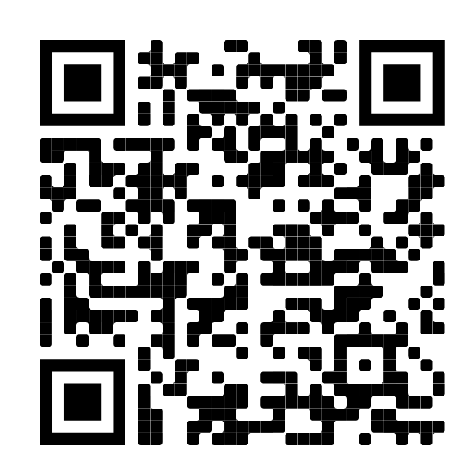

# Atelier Thingsat de l'Ecole d'été Rescom 2022

https://rsd-ecole.cnrs.fr/2022/

## TLE and Celestrak
* [Celestrak](https://celestrak.org/) (please donate)
* [Search ISS, GPS, STORK-1, NORBI ... on Celestrak](https://celestrak.org/satcat/search.php)
* [Show TLE of STORK-1 (51087)](https://celestrak.org/NORAD/elements/gp.php?CATNR=51087)
* [Show TLE of NORBI (46494)](https://celestrak.org/NORAD/elements/gp.php?CATNR=46494)

## TinyGS

### GUI
* [Norbi Satellite View](https://tinygs.com/satellite/Norbi)
* [Norbi Packet View](https://tinygs.com/packet/44aa0441-4d7a-412e-90f0-cd41276cc73f)
* [DJ2DS Gateway View](https://tinygs.com/station/DJ2DS@943157002)

### API
#### Telegram
* [Join group on Telegram](https://t.me/joinchat/DmYSElZahiJGwHX6jCzB3Q)
* https://t.me/tinygs_personal_bot 
* https://t.me/tinyGS_Telemetry

#### HTTP REST (API v1 and v2)
* All stations : https://api.tinygs.com/v1/stations
* Last packets : https://api.tinygs.com/v1/packets 
* https://api.tinygs.com/v2/packets 

### NodeRED - InfluxDB - Grafana 
* https://github.com/thingsat/tinygs-nodered-gateway

### GPredict

* [Find TLEs on Celestrak]()
* Add them into GPredict

### Thingsat
* [High altitude LoRa Benchmarking](https://gricad-gitlab.univ-grenoble-alpes.fr/thingsat/public/-/tree/master/balloons)
* [Cubesat mission](https://gricad-gitlab.univ-grenoble-alpes.fr/thingsat/public/-/tree/master/cubesat_mission)
** [Messages format](https://gricad-gitlab.univ-grenoble-alpes.fr/thingsat/public/-/tree/master/cubesat_mission/messages)
** [Mission scenarii](https://gricad-gitlab.univ-grenoble-alpes.fr/thingsat/public/-/blob/master/cubesat_mission/mission_scenario/README.md)

